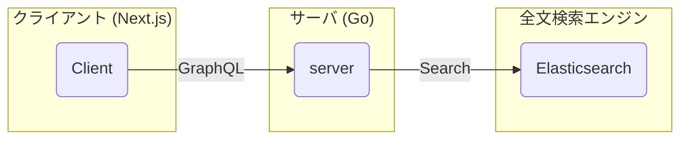

# audio-searcher

- ローカルのオーディオファイルを探して楽に DJ するためのもの
- デプロイして使うつもりはない

```mermaid
graph LR
  subgraph "クライアント (Next.js)"
    c(Client)
  end

  subgraph "サーバ (Go)"
    b(server)
  end

  subgraph "全文検索エンジン"
    e(Elasticsearch)
  end

  c -- GraphQL --> b
  b -- Search --> e
```
